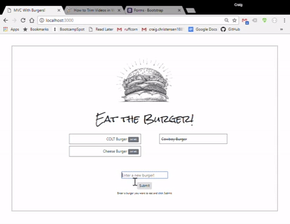

# **Eat the Burger**

A practice app using Node, Express, Handlebars and MySQL.  Add a burger in the text box and click Submit.  The new burger will be added to the left-hand column.  Click the Eat Me button of any burger and it will be moved to the right-hand (eaten) column.




## **INSTALLATION INSTRUCTIONS**

### **Requirements**
Users must have [git](https://git-scm.com/book/en/v2/Getting-Started-Installing-Git), [MySQL](https://www.mysql.com/downloads/) and [Node.js](https://nodejs.org/en/download/) installed before completing these instructions.

### **Installing the app**

1) From git bash, Terminal or Command Prompt, clone this repository to a directory on your computer.  <br>
  ```git clone https://github.com/ruffcorn33/Burger.git```
2) Change directory to the Burger directory.<br>
  ```cd Burger```
3) Initialize the app with a package.json file.<br>
  ```npm init```  
  Follow the command line instructions.  You can just accept all of the defaults.
4) Install the app.<br>
  ```npm install```
  This will create a node_modules folder and install all of the dependent modules.

Users will need to add a file name '.env' to the project folder. 
  Add this line to the file:

  ```MYSQL_PASSWORD=?????????```

  Replace the question marks with your MySQL password.

### **Setting up the MySQL database**

1) Log in to MySQL Workbench.  From the home screen, create a new connection by clicking the + symbol beside 'MySQL Connections'.  Name the connection 'Burgers_DB'.

2) Click the new connection box to open it.  From the File menu, select 'Open SQL Script'.  Navigate to your project folder/db and select schema.sql.  Run the code to create the database and the `burgers` table.

3) Click File/Open SQL Script again, navigate to the project/db folder and select seeds.sql.  Run the code in seeds.sql to populate the table with seed data.

### **Running the Burger app**

Enter 'node server' from the command line.  You should see the message <br>`Express server listening on PORT 3000`<br>
`MySQL DB: connected as id 13`.

Open a browser and navigate to `localhost:3000`.  This will open the Burger application page.  You will see a column of uneaten burgers on the left and a column of eaten burgers on the right.  Clicking the 'EAT ME!' button beside a burger will move it from the left column to the right column.  Below the two columns of burger is a text box where you can enter the name of a new burger.  New burgers appear in the left column... and you can probably guess the rest.

## **What's going on here?**

This app hides several technolgies and a lot of complexity behind its simple UI.  Like what?  Well, the main file `server.js` uses four Node.js modules, [express](https://www.npmjs.com/package/express), [body-parser](https://www.npmjs.com/package/express), [express-handlebars](https://www.npmjs.com/package/express-handlebars) and [dotenv](https://www.npmjs.com/package/dotenv).  **Express** is a web framework that we use to create a web server. **Body-parser** is middleware that handles response data.  **Express-handlebars** is a view/template engine that lets us insert dynamic HTML into a static HTML template.  **Dotenv** loads the user's MySQL password into an environment variable.  This lets us package the app without exposing a developer password.

The `connection.js` file uses the [mysql](https://www.npmjs.com/package/mysql) module to connect to a MySQL database.

This project also makes use of a custom designed **Object Relational Mapping tool** (ORM) to abstract away the SQL code for queries to the database.  

This application uses the Model-View-Controller architectural pattern.


